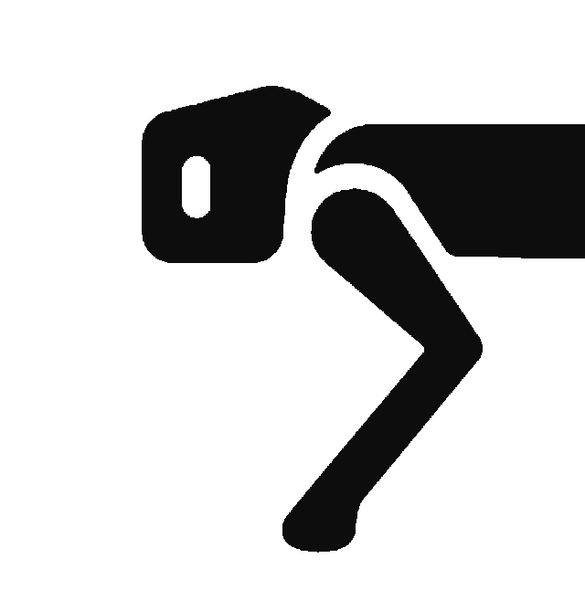

<p align="center">
  
</p>

# Go2 Dashboard Frontend

React + TypeScript SPA for the Unitree Go2 dashboard. Vite dev server on port 5173; all robot and recording I/O goes through the backend REST API (`/api/*`).

Part of the [unitree_dog](../) monorepo. See the root [README](../README.md) for overall architecture.

## Layout

```
frontend/
  package.json
  vite.config.ts      # dev server + /api proxy
  src/
    App.tsx           # routes + session list
    api.ts            # types, fetch helpers, grid decode
    pages/
      HomePage.tsx
      LivePage.tsx
      RecordingPage.tsx
    components/
      ReplayPlayer.tsx    # timeline + live/replay orchestration
      PointCloudView.tsx  # 3D lidar follow view
      FloorPlanView.tsx   # 2D map display + pan/zoom
      TelemetryPanel.tsx
      SessionInfoPanel.tsx
      Sidebar.tsx
      unitreeDog.ts       # pose/heading math + robot icons
```

## Routes

| Route | Page | Purpose |
|-------|------|---------|
| `/` | HomePage | Landing; pick a session from the sidebar |
| `/live` | LivePage | Connect to robot, record, view live telemetry |
| `/recordings/:id` | RecordingPage | Replay a saved session |

## What the frontend does

The frontend owns **visualization, playback sync, and UI state**. It never talks to the robot directly.

| Area | Role |
|------|------|
| **API client** (`api.ts`) | Typed fetch wrappers for `/api/live/*` and `/api/recordings/*`; base64 floor-plan grid decoding; duration/time formatting |
| **Playback** (`ReplayPlayer.tsx`) | Timeline scrub/play; `requestAnimationFrame` clock in replay mode; 100 ms polling in live mode; aborts stale frame requests on scrub |
| **3D lidar** (`PointCloudView.tsx`) | Odom→scene transforms, follow-camera from pose quaternion, pinhole projection, height-colored voxel rendering, ground grid, robot footprint |
| **2D floor plan** (`FloorPlanView.tsx`) | Fetches backend-built maps; rasterizes zones/walls with edge styling; pan/zoom/drag; smart refetch by time and lidar seq |
| **Pose / icons** (`unitreeDog.ts`) | Quaternion→heading, arrow direction from velocity or path tangent, angle smoothing, canvas robot/arrow markers |
| **Telemetry** (`TelemetryPanel.tsx`) | Display formatting for battery, IMU, sport mode, UWB, etc. (data already parsed by backend) |
| **Live** (`LivePage.tsx`) | Connect/disconnect flow, status polling, start/stop recording |

## What the frontend does not do

- WebRTC or robot connection
- Topic parsing or session recording to disk
- Floor-plan construction from raw lidar (backend `floorplan/`)
- Lidar decoding beyond receiving binary `Float32Array` from the API

## Frontend vs backend

| Layer | Frontend | Backend |
|-------|----------|---------|
| Robot I/O | — | WebRTC, recording |
| Data processing | Minimal (decode grids, filter points for display) | Parsing, indexing, floor-plan build |
| Logic | Playback sync, 3D/2D rendering, camera math, UI state | Everything that touches the robot or disk |

`PointCloudView` and `FloorPlanView` are non-trivial rendering code — not thin React wrappers around backend output.

## Local development

From the repo root (backend must be running on :8080):

```bash
cd frontend
npm install
npm run dev
```

Open http://localhost:5173. Vite proxies `/api` to `http://127.0.0.1:8080` (override with `VITE_API_TARGET`).

## Docker

From the repo root:

```bash
docker compose up --build
```

The frontend container sets `VITE_API_TARGET=http://host.docker.internal:8080` so the proxy reaches the backend (which uses `network_mode: host` to reach the robot on your LAN).
